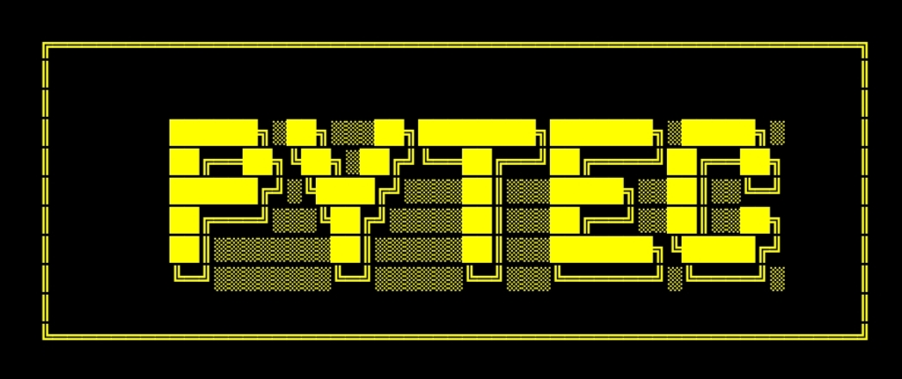

<h1 align="center">⚡ PyTec - Multifunctional Cyber Toolkit ⚡</h1>

<p align="center">
  <b>Made with ❤️ by ★彡[𝐌𝐔𝐒𝐋𝐈𝐌 𝐔𝐃𝐃𝐈𝐍 𝐌𝐊]彡★</b><br>
  <i>🚀 An all-in-one cyber toolkit for ethical hackers and learners in 🇧🇩</i>
</p>

<!-- BADGES -->
<p align="center">
  
  
  
  
</p>


<p align="center">
  
</p>

---

## ✨ Features

| 🔢 Option | 🛠️ Tool Name          | 📄 Description                                 |
|----------|------------------------|-----------------------------------------------|
| [1]      | 📱 SMS Bomber          | Send multiple OTPs to a number *(Updating)*    |
| [2]      | 🔳 QR Code Generator   | Create stylish and custom QR codes             |
| [3]      | 🔗 URL Shortener       | Shrink long URLs using TinyURL API             |
| [4]      | 💬 Custom SMS          | Send personalized messages *(Updating)*        |
| [5]      | 🌐 Web Cloner          | Clone and display target website's HTML code   |
| [6]      | 💣 DDoS Attack         | Medium & High-Level UDP Flood tools            |
| [7]      | 🔐 Admin Panel Finder  | Scan sites for hidden admin login panels       |

---

## ⚙️ Installation

### 📱 Termux Users

```bash
pkg update -y && pkg upgrade -y
pkg install python -y
pkg install git -y
pkg install wget -y
pip install requests
git clone https://github.com/yourusername/PyTec.git
cd PyTec
python PyTec.py
```

### 🐧 Kali Linux Users

```bash
sudo apt update && sudo apt upgrade -y
sudo apt install python3 -y
sudo apt install git -y
sudo apt install wget -y
pip3 install requests
git clone https://github.com/yourusername/PyTec.git
cd PyTec
python3 PyTec.py
```

### 📦 Dependencies

```bash
pip install requests pyshorteners qrcode
```

---

## 🔐 Login Info

🔑 *Contact the Admin to get your Username & Password.*

---

## 🖼️ Banner

### 🎞️ PyTec Tools Main Banner


---

## ⚠️ Disclaimer

> ⚠️ PyTec is built for **educational and ethical purposes only**. Any misuse is strictly discouraged. The developer is **not responsible** for unethical usage.

---

## 👨‍💻 Developer Info

- 👤 **Name:** Muslim Uddin MK  
- 🌐 **Website:** [mk777.rf.gd](http://mk777.rf.gd/?i=1)  
- 📘 **Facebook:** [Profile](https://www.facebook.com/profile.php?id=100077752513671)

---

## 🌟 Special Thanks

🙏 Huge thanks to all testers, friends, and supporters who inspired the development journey.

<p align="center"><b>💖 STAY WITH MK-777 💖</b></p>
